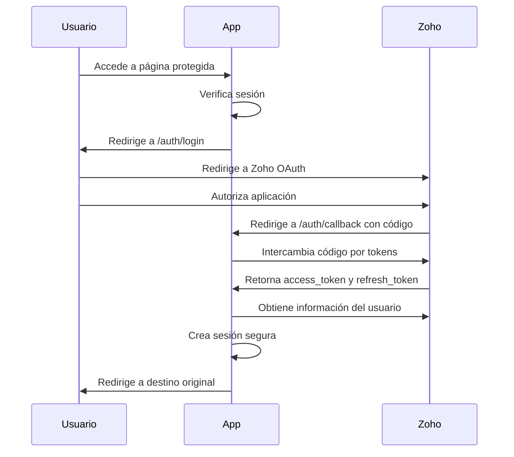

# Zoho OAuth2 Authentication Migration

Este documento describe la migración del sistema de autenticación de Auth0 a OAuth2 directo con Zoho.

## 📋 Resumen de Cambios

### ✅ Completado
- ❌ **Eliminada dependencia de Auth0** (`@auth0/nextjs-auth0`)
- ✅ **Implementado OAuth2 con Zoho** directo
- ✅ **Creado sistema de sesiones seguro** con cookies HTTP-only
- ✅ **Actualizado middleware** para verificación de autenticación
- ✅ **Creadas páginas de autenticación** (login/logout/callback/error)
- ✅ **Reemplazado Auth0Provider** con UserProvider personalizado
- ✅ **Actualizada interfaz de usuario** para nuevo sistema

## 🔧 Variables de Entorno Requeridas

Asegúrate de tener estas variables en tu archivo `.env.local`:

```bash
# Zoho OAuth Configuration (NUEVAS)
ZOHO_CLIENT_ID=tu_client_id_de_zoho
ZOHO_CLIENT_SECRET=tu_client_secret_de_zoho
ZOHO_REDIRECT_URI=http://localhost:3000/auth/callback
ZOHO_ACCOUNTS_BASE=https://accounts.zoho.com
ZOHO_ORG_ID=tu_organization_id

# Zoho API Configuration (EXISTENTES - mantener)
ZOHO_DOMAIN=com
ZOHO_REFRESH_TOKEN=tu_refresh_token
ZOHO_GRANT_TYPE=refresh_token
```

## 🚀 Configuración de Aplicación Zoho

1. Ve a [Zoho Developer Console](https://api-console.zoho.com/)
2. Crea una nueva aplicación "Self Client"
3. Configura:
   - **Redirect URI**: `http://localhost:3000/auth/callback`
   - **Scopes**: `ZohoInventory.FullAccess.all,ZohoInventory.settings.READ`
4. Copia el Client ID y Client Secret
5. Obtén tu Organization ID de Zoho Inventory

## 🔐 Flujo de Autenticación



## 📁 Archivos Modificados/Creados

### 🆕 Nuevos Archivos
- `lib/auth/zohoAuth.ts` - Cliente OAuth2 de Zoho
- `lib/auth/UserProvider.tsx` - Contexto de React para usuario
- `app/auth/login/page.tsx` - Página de login
- `app/auth/logout/page.tsx` - Página de logout
- `app/auth/callback/page.tsx` - Callback de OAuth
- `app/auth/error/page.tsx` - Página de error
- `app/api/auth/user/route.ts` - API para información de usuario

### 🔄 Archivos Modificados
- `middleware.ts` - Verificación de autenticación con Zoho
- `app/layout.tsx` - UserProvider en lugar de Auth0Provider
- `app/page.tsx` - useUser personalizado
- `package.json` - Removida dependencia de Auth0
- `types/zoho.d.ts` - Añadidos tipos para autenticación
- `.env.example` - Actualizadas variables de entorno

### 🗑️ Archivos Eliminados
- `lib/auth/auth0.js` → Reemplazado por `lib/auth/zohoAuth.ts`

## 🔗 URLs de Autenticación

- **Login**: `/auth/login`
- **Logout**: `/auth/logout`
- **Callback**: `/auth/callback`
- **Error**: `/auth/error`

## 🧪 Testing

### Flujo Completo de Autenticación

1. **Acceso inicial**:
   ```bash
   # Inicia el servidor
   pnpm dev
   
   # Visita http://localhost:3000
   # Click en "Login to Dashboard"
   ```

2. **Autorización en Zoho**:
   - Deberías ser redirigido a Zoho
   - Autoriza la aplicación
   - Serás redirigido de vuelta

3. **Verificación de sesión**:
   - El nombre del usuario debería aparecer
   - Deberías poder acceder al dashboard
   - Prueba `/auth/logout` para cerrar sesión

### Verificación de Seguridad

```bash
# Verifica que las cookies se establecen correctamente
# En DevTools > Application > Cookies
# Deberías ver: zoho-session (HttpOnly: true)
```

## 🛡️ Características de Seguridad

- **Cookies HTTP-only**: Las sesiones no son accesibles via JavaScript
- **Refresh automático**: Los tokens se renuevan automáticamente
- **Validación de estado**: Protección contra ataques CSRF
- **Middleware de protección**: Todas las rutas protegidas requieren autenticación
- **Timeout de sesión**: Las sesiones expiran en 24 horas

## 🔄 Hook `useUser`

Reemplaza el hook de Auth0:

```tsx
// Antes (Auth0)
import { useUser } from "@auth0/nextjs-auth0";
const { user, isLoading } = useUser();

// Ahora (Zoho)
import { useUser } from "../lib/auth/UserProvider";
const { user, isLoading, error } = useUser();

// Tipos de usuario
interface ZohoUser {
  user_id: string;
  name: string;
  email_ids: Array<{ email: string; is_selected: boolean }>;
  status: string;
  user_role: string;
  // ... más campos
}
```

## 🐛 Troubleshooting

### Error: "Missing required Zoho OAuth environment variables"
- Verifica que todas las variables ZOHO_* estén configuradas en `.env.local`

### Error: "Token exchange failed"
- Verifica Client ID y Client Secret
- Asegúrate que el Redirect URI coincida exactamente

### Error: "Failed to get user info"
- Verifica que el Organization ID sea correcto
- Asegúrate que el usuario tenga permisos en la organización

### Sesión no se mantiene
- Verifica que las cookies estén habilitadas
- En producción, asegúrate que HTTPS esté configurado

## 📊 Comparación Auth0 vs Zoho OAuth2

| Aspecto              | Auth0                       | Zoho OAuth2                        |
| -------------------- | --------------------------- | ---------------------------------- |
| **Dependencias**     | `@auth0/nextjs-auth0`       | Implementación nativa              |
| **Configuración**    | Variables Auth0 + Dashboard | Variables Zoho + Developer Console |
| **Sesiones**         | Manejadas por Auth0         | Cookies HTTP-only propias          |
| **Datos de usuario** | Perfil Auth0                | Usuario Zoho Inventory directo     |
| **Refresh tokens**   | Automático por Auth0        | Implementación manual              |
| **Seguridad**        | Manejada por Auth0          | Control total                      |

## ✅ Verificación Final

- [ ] Build exitoso (`pnpm build`)
- [ ] Variables de entorno configuradas
- [ ] Aplicación Zoho creada y configurada
- [ ] Login funcional con redirección
- [ ] Logout funcional
- [ ] Información de usuario mostrada correctamente
- [ ] Protección de rutas funcionando
- [ ] Refresh de tokens automático

---

**🎉 Migración completada exitosamente!**

La aplicación ahora usa autenticación OAuth2 directa con Zoho, eliminando la dependencia de servicios terceros y proporcionando control total sobre el flujo de autenticación.
